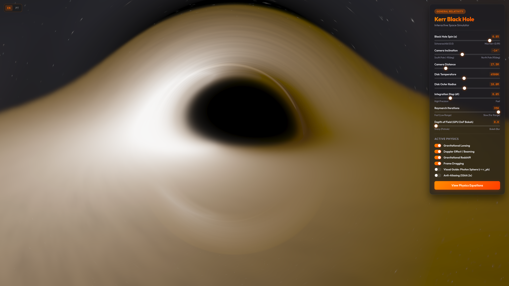

*Leia isto em outros idiomas: [English](README.md), [Português](README_pt.md).*

# 🌌 Gargantua: Relativistic Kerr Black Hole Simulator

> Um simulador interativo de **Buraco Negro Rotativo (Kerr)**, rodando 100% no navegador. Desenvolvido em **HTML5, Javascript e WebGL (Fragment Shader)**, ele realiza traçado de raios reverso (reverse ray tracing) resolvendo numericamente geodésicas nulas de fótons no espaço-tempo curvo de Kerr.

A simulação incorpora geodésicas completas de Kerr usando formulação hamiltoniana conservativa em coordenadas de Kerr-Schild, integrador numérico RK4 com passo adaptativo por gradiente métrico, disco de acreção volumétrico 3D com termodinâmica de Novikov-Thorne, esferas de fótons de Kerr com anéis de Einstein, Amplificação por Doppler Relativístico, Redshift Gravitacional, Profundidade de Campo Física na GPU (Bokeh DoF), Mapeamento de Tom Fílmico ACES e Antialiasing por Supersampling (SSAA 2x).

> **Aviso:** Este é um projeto de hobby independente construído por paixão pela astrofísica e relatividade geral. O código incorpora equações teóricas rigorosas (Bardeen 1972, Teo 2003, Chan 2018, Bacchini 2018) aliadas a otimizações numéricas na GPU e escala de brilho perceptual.

---

## 📸 Preview (Demonstração)

<p align="center">
  
  <br>
  <i>Renderização em tempo real na GPU do buraco negro supermassivo de Kerr.</i>
</p>

---

## Sumário
1. [Metodologia de Renderização (Ray Tracing Reverso)](#1-metodologia-de-renderizacao-ray-tracing-reverso)
2. [Geometria do Espaço-Tempo de Kerr-Schild](#2-geometria-do-espaco-tempo-de-kerr-schild)
3. [Integração das Geodésicas Relativísticas (RK4 Hamiltoniano Conservativo com Passo Adaptativo)](#3-integracao-das-geodesicas-relativisticas-rk4-hamiltoniano-conservativo-com-passo-adaptativo)
4. [Arrasto de Referencial (Frame Dragging) e Movimento no Mergulho ZAMO](#4-arrasto-de-referencial-frame-dragging-e-movimento-no-mergulho-zamo)
5. [Física do Disco de Acreção Volumétrico](#5-fisica-do-disco-de-acrecao-volumetrico)
   - [Perfil Térmico de Novikov-Thorne Normalizado](#51-perfil-termico-de-novikov-thorne-normalizado)
   - [Modelagem Volumétrica 3D do Gás (Lei de Beer-Lambert)](#52-modelagem-volumetrica-3d-do-gas-lei-de-beer-lambert)
   - [Redshift Gravitacional e Beaming Doppler Covariante](#53-redshift-gravitacional-e-beaming-doppler-covariante)
6. [Guia Visual: Esfera de Fótons Exata de Kerr (Bardeen 1972 / Teo 2003)](#6-guia-visual-esfera-de-fotons-exata-de-kerr-bardeen-1972--teo-2003)
7. [Profundidade de Campo Física na GPU (Bokeh de Abertura de Lente)](#7-profundidade-de-campo-fisica-na-gpu-bokeh-de-abertura-de-lente)
8. [Mapeamento de Tom Fílmico e Antialiasing (SSAA 2x)](#8-mapeamento-de-tom-filmico-e-antialiasing-ssaa-2x)
9. [Referências Científicas](#9-referencias-cientificas)
10. [Instalação e Execução](#10-instalacao-e-execucao)

---

## 1. Metodologia de Renderização (Ray Tracing Reverso)

Para obter 60 FPS direto no navegador, o simulador utiliza **Ray Tracing Reverso** no *Fragment Shader* WebGL.

Em vez de simular fótons emitidos do disco de acreção em todas as direções aleatórias (onde apenas uma fração minúscula atingiria a câmera), os fótons são integrados de **trás para frente** no tempo, partindo da lente da câmera (observador) em direção ao buraco negro.

Para cada pixel da tela:
1. As coordenadas 2D da tela são mapeadas para um vetor tridimensional de direção inicial do fóton $\mathbf{n}$.
2. O momento canônico inicial do fóton $\mathbf{p}$ é calculado na posição do observador com base no tensor métrico de Kerr-Schild $f(r, \theta)$ e no vetor nulo $\mathbf{l}$.
3. A trajetória geodésica nula é integrada numericamente passo a passo pelo método Runge-Kutta de 4ª Ordem (RK4) com passo adaptativo por gradiente métrico.
4. Conforme o fóton caminha, ele acumula emissão e opacidade do disco de acreção 3D pela lei de Beer-Lambert.
5. Se o fóton entra no horizonte de eventos externo ($r_{\text{eff}} \le r_+ = M + \sqrt{M^2 - a^2}$), a integração cessa imediatamente e o pixel é marcado como sombra do buraco negro.
6. Se o fóton escapa para distâncias radiais maiores que o limite de escape dinâmico ($R^2 > R_{\text{escape}}^2$), o momento final é usado para amostrar o fundo de estrelas procedurais e poeira galáctica.

---

## 2. Geometria do Espaço-Tempo de Kerr-Schild

Um buraco negro rotativo com massa gravitacional $M$ e spin $J$ é descrito pela métrica de Kerr. O parâmetro de spin adimensional $a = J/M$ ($0 \le a < 1$) rege a rotação e o arrasto de referencial.

Em coordenadas cartesianas de Kerr-Schild $(x,y,z)$, o tensor métrico é decomposto no espaço plano de Minkowski mais um fator métrico escalar $f(r, \theta)$ e um vetor nulo $l_\mu$:
$$g_{\mu\nu} = \eta_{\mu\nu} + f l_\mu l_\nu$$
onde:
$$f(r, \theta) = \frac{2 M r^3}{r^4 + a^2 z^2}$$
$$l_\mu = \left(1, \frac{r x + a y}{r^2 + a^2}, \frac{r y - a x}{r^2 + a^2}, \frac{z}{r}\right)$$

A coordenada radial física $r$ de Kerr é calculada resolvendo a equação oblata:
$$\frac{x^2 + y^2}{r^2 + a^2} + \frac{z^2}{r^2} = 1$$
obtendo a solução quadrática exata:
$$r^2 = \frac{1}{2}\left(R^2 - a^2\right) + \frac{1}{2}\sqrt{\left(R^2 - a^2\right)^2 + 4 a^2 z^2}$$
onde $R^2 = x^2 + y^2 + z^2$. O horizonte de eventos externo localiza-se em:
$$r_+ = M + \sqrt{M^2 - a^2}$$

---

## 3. Integração das Geodésicas Relativísticas (RK4 Hamiltoniano Conservativo com Passo Adaptativo)

Fótons seguem geodésicas nulas ($ds^2 = 0$). O simulador utiliza a **Formulação Hamiltoniana Conservativa** (Chan, Medeiros & Ozel 2018; Bacchini et al. 2018) em coordenadas de Kerr-Schild para computar as equações de movimento da posição $\mathbf{x}$ e do momento $\mathbf{p}$:
$$\frac{d\mathbf{x}}{d\lambda} = \mathbf{p} - f \mathbf{l} V$$
$$\frac{d\mathbf{p}}{d\lambda} = \frac{1}{2} V^2 \nabla f + f V (\mathbf{p} \cdot \nabla \mathbf{l})$$
onde $V = (\mathbf{p} \cdot \mathbf{l}) - 1$.

A integração é realizada usando o **Método de Runge-Kutta de 4ª Ordem (RK4)** com um **Passo Adaptativo por Gradiente Métrico**:
$$dt_{\text{local}} = dt_{\text{base}} \cdot \frac{\text{clamp}(r / 1.5, 0.25, 40.0)}{1 + 1.2 \|\nabla f\|}$$

Isso refina dinamicamente a precisão matemática perto de gradientes de forte curvatura ($\|\nabla f\|$) e perto do horizonte ($r \to r_+$), enquanto previne erros de penetração no horizonte via proteção dupla por fall-through.

---

## 4. Arrasto de Referencial (Frame Dragging) e Movimento no Mergulho ZAMO

Quando o buraco negro rotaciona ($a > 0$), o próprio espaço-tempo é arrastado ao redor do eixo central (efeito Lense-Thirring).

1. **Arrasto Geodésico:** As derivadas métricas $\nabla f$ e $\nabla \mathbf{l}$ nas equações hamiltonianas arrastam as trajetórias da luz na direção do spin. Um parâmetro unificado de spin $a_{\text{geo}} = \text{u\_dragging} ? a : 0.0$ garante consistência física entre as geodésicas da luz e a cinemática do disco.
2. **Mistura de Velocidades no Mergulho (Plunge Region):** O plasma dentro da ISCO ($r < r_{\text{isco}}$) não mantém órbitas Keplerianas estáveis. A velocidade angular orbital $\Omega_K$ faz transição suave da velocidade Kepleriana na ISCO ($\Omega_{\text{isco}}$) para a velocidade de arraste ZAMO (Zero Angular Momentum Observer) ($\Omega_{\text{zamo}} = -g_{t\phi}/g_{\phi\phi}$) no horizonte:
$$\Omega_K(r) = \text{mix}\left(\Omega_{\text{zamo}}, \Omega_{\text{isco}}, \text{smoothstep}(r_+, r_{\text{isco}}, r)\right)$$

---

## 5. Física do Disco de Acreção Volumétrico

### 5.1 Perfil Térmico de Novikov-Thorne Normalizado
A matéria equatorial orbita fora da Órbita Circular Estável Mais Interna (ISCO). O raio ISCO prograde $r_{\text{isco}}$ é calculado pelas equações de Bardeen et al. (1972) com precisão nativa de `Math.cbrt`:
$$r_{\text{isco}} = M \left( 3 + x_2 - \sqrt{(3-x_1)(3+x_1+2x_2)} \right)$$
$$x_1 = 1 + \sqrt[3]{1 - a^2} \left( \sqrt[3]{1+a} + \sqrt[3]{1-a} \right)$$
$$x_2 = \sqrt{3 a^2 + x_1^2}$$

A temperatura do plasma segue o perfil relativístico de disco fino de **Novikov-Thorne** (1973):
$$T(r) = T_{\text{peak}} \cdot \left(\frac{r_{\text{isco}}}{r}\right)^{0.75} \cdot \left(1 - \sqrt{\frac{r_{\text{isco}}}{r}}\right)^{0.25} \cdot 2.2$$

### 5.2 Modelagem Volumétrica 3D do Gás (Lei de Beer-Lambert)
O disco possui perfil de densidade com decaimento gaussiano vertical, decaimento exponencial radial e ruído de turbulência multi-escala:
$$\rho(r, z) = e^{-0.10(r - r_{\text{isco}})} \cdot e^{-\frac{z^2}{0.08}} \cdot \text{Noise}_{3D}\left(\mathbf{p}_{\text{rot}}\right)$$

O ray marching volumétrico acumula opacidade e emissão ao longo da distância $dt$ usando a **Lei de Beer-Lambert** ($k_{\text{opacidade}} = 6.0$):
$$\Delta \alpha = 1 - e^{-\rho \cdot dt \cdot k_{\text{opacidade}}}$$
$$\mathbf{I}_{\text{acum}} = \mathbf{I}_{\text{acum}} + (1 - \alpha_{\text{acum}}) \cdot \mathbf{C}_{\text{emissao}} \cdot \Delta \alpha$$

### 5.3 Redshift Gravitacional e Beaming Doppler Covariante
1. **Redshift Gravitacional e Cinemático ($g_{\text{grav}}$):**
$$g_{\text{grav}} = \frac{g_{\text{obs}}}{u^t_{\text{disc}}}$$
onde $u^t_{\text{disc}} = 1/\sqrt{-(g_{tt} + 2 \Omega_K g_{t\phi} + \Omega_K^2 g_{\phi\phi})}$.

2. **Amplificação Doppler ($g_{\text{doppler}}$):**
$$g_{\text{doppler}} = \frac{1}{\max(0.25, 1 - \Omega_K L_z)}$$
onde $L_z = x p_y - y p_x$ é o momento angular axial de Killing do fóton.

A temperatura observada do plasma $T_{\text{obs}} = g_{\text{fator}} \cdot T(r)$ é mapeada para cor de corpo negro RGB pelo algoritmo de Tanner Helland com escala perceptual de luminosidade para alto alcance dinâmico no WebGL.

---

## 6. Guia Visual: Esfera de Fótons Exata de Kerr (Bardeen 1972 / Teo 2003)

Quando ativada na interface, uma grade visual 3D destaca o raio analítico exato da órbita esférica de fótons derivada por Bardeen et al. (1972) e Teo (2003):
$$r_{\text{foton}} = 2 M \left(1 + \cos\left(\frac{2}{3} \arccos(-a_{\text{geo}} / M)\right)\right)$$

Para Schwarzschild ($a=0$), $r_{\text{foton}} = 3M$. Para Kerr máximo ($a=0.99M$), $r_{\text{foton}}$ ajusta-se analiticamente para $1.17M$.

---

## 7. Profundidade de Campo Física na GPU (Bokeh de Abertura de Lente)

Em vez de um desfoque 2D plano por CSS, o simulador incorpora um modelo de **Abertura de Lente Fina Física** rodando diretamente no fragment shader do WebGL.

Quando o DoF está ativo:
1. A origem do raio é perturbada no plano da lente da câmera usando amostragem uniforme de disco: $\mathbf{P}_{\text{lente}} = \mathbf{P}_{\text{câmera}} + r_{\text{abertura}} (\cos\theta \mathbf{R} + \sin\theta \mathbf{U})$.
2. A direção do raio é reapontada para o ponto alvo de foco em distância $D_{\text{foco}} = \|\mathbf{P}_{\text{câmera}}\|$.
3. A amostragem de sub-pixels do SSAA 2x atua naturalmente como um denoiser Monte Carlo gratuito para o desfoque Bokeh óptico.

---

## 8. Mapeamento de Tom Fílmico e Antialiasing (SSAA 2x)

### 8.1 Mapeamento de Tom Fílmico ACES com Exposição
Para evitar estouro de branco em regiões de altíssimo Doppler mantendo os degradês avermelhados de corpo negro, o shader utiliza um mapeamento de tom fílmico expositivo:
$$\mathbf{I}_{\text{tela}} = \left(1 - e^{-\mathbf{I}_{\text{acum}} \cdot 1.1}\right)^{\frac{1}{2.2}}$$

### 8.2 Antialiasing por Supersampling (SSAA 2x)
Quando ativo, amostra 4 sub-pixels em padrão de grade rotacionada por pixel:
$$\mathbf{I}_{\text{final}} = \frac{1}{4} \sum_{s=1}^{4} \mathbf{I}\left(\text{gl\_FragCoord} + \mathbf{offset}_s\right)$$

---

## 9. Referências Científicas

* **Métrica de Kerr (1963):** Kerr, R. P. *"Gravitational Field of a Spinning Mass"* ([Phys. Rev. Lett. 11, 237](https://journals.aps.org/prl/abstract/10.1103/PhysRevLett.11.237)).
* **ISCO e Órbitas em Kerr (1972):** Bardeen, J. M., Press, W. H., & Teukolsky, S. A. *"Rotating Black Holes"* ([ApJ, 178, 347-370](https://adsabs.harvard.edu/full/1972ApJ...178..347B)).
* **Órbitas Esféricas de Fótons no Espaço-Tempo de Kerr (2003):** Teo, E. *"Spherical Photon Orbits in the Kerr Spacetime"* ([General Relativity and Gravitation 35, 1909-1926](https://doi.org/10.1023/A:1026286607562)).
* **Integrador Geodésico em KS (2018):** Chan, C.-k., Medeiros, L., & Ozel, F. *"GRay2: geodesic integrator in Kerr-Schild coordinates"* ([ApJ 867 59](https://iopscience.iop.org/article/10.3847/1538-4357/aae4dd)).
* **Geodésicas Hamiltonianas Conservativas (2018):** Bacchini, F., Ripperda, B., & Chen, A. Y. *"Conservative Hamiltonian formulation for general relativistic geodesics"* ([ApJS 237 6](https://iopscience.iop.org/article/10.3847/1538-4365/aac88f)).
* **Disco de Acreção de Novikov-Thorne (1973):** Novikov, I. D., & Thorne, K. S. *"Astrophysics of black holes"* em Black Holes (Les Astres Occlus), 343-450.
* **Temperatura de Cor de Tanner-Helland:** Tanner Helland's *"How to Convert Temperature (K) to RGB"* ([TannerHelland.com](https://tannerhelland.com/2012/10/26/color-temperature-rgb.html)).

---

## 10. Instalação e Execução

### Requisitos
- **Node.js** (versão 14 ou superior)
- Um **Navegador Moderno** com suporte a WebGL 1.0 / 2.0 (Chrome, Firefox, Safari, Edge).

### Execução Local
1. Clone o repositório e entre na pasta:
   ```bash
   git clone https://github.com/zlkingado/blackhole-simulator-js.git
   cd blackhole-simulator-js
   ```
2. Instale as dependências:
   ```bash
   npm install
   ```
3. Inicie o servidor da aplicação:
   ```bash
   npm start
   ```
4. Abra o navegador em **`http://localhost:3000`** (ou abra `public/index.html` diretamente).

---

## 📜 Licença (MIT)

Este projeto é de código aberto e está licenciado sob a **Licença MIT**. Veja o arquivo `LICENSE` para detalhes.
